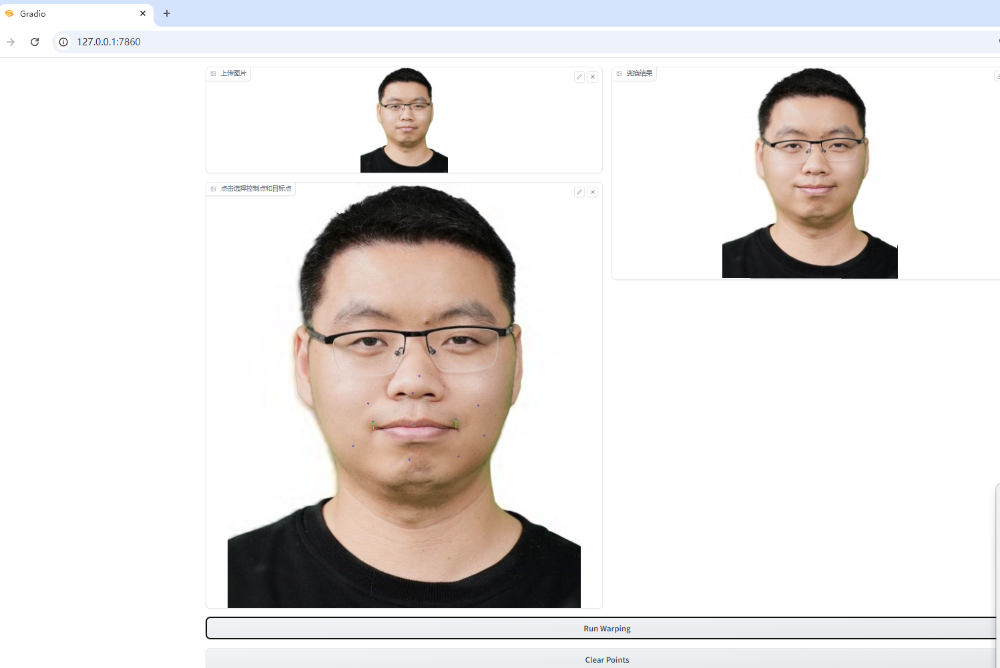

# Assignment 1 - Image Warping

This repository is the implementation of Assignment 1 for the Digital Image Processing course.

- Student: 程开良
- Student ID: SA25001013
- Course: 数字图像处理



## Requirements

To install requirements:

```bash
python -m pip install -r requirements.txt
```

## Running

To run the basic transformation demo:

```bash
python run_global_transform.py
```

To run the point-guided deformation demo:

```bash
python run_point_transform.py
```

## Results

| Module | Status | Description |
| --- | --- | --- |
| Basic geometric transformation | Completed | Scaling, rotation, translation, and horizontal flip |
| Point-guided image deformation | Completed | RBF/Thin Plate Spline based image warping |

### Basic Transformation


### Point Guided Deformation


## Notes

- `run_global_transform.py` implements composed affine transformation around the image center.
- `run_point_transform.py` implements control-point-based image deformation with interactive point selection.

## Acknowledgement

- [Image Deformation Using Moving Least Squares](https://people.engr.tamu.edu/schaefer/research/mls.pdf)
- [Image Warping by Radial Basis Functions](https://www.sci.utah.edu/~gerig/CS6640-F2010/Project3/Arad-1995.pdf)
- [OpenCV Geometric Transformations](https://docs.opencv.org/4.x/da/d6e/tutorial_py_geometric_transformations.html)
- [Gradio Documentation](https://www.gradio.app/)
