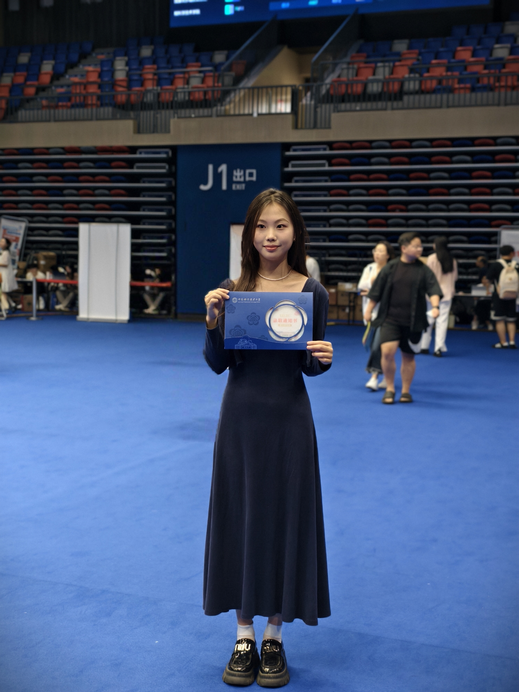
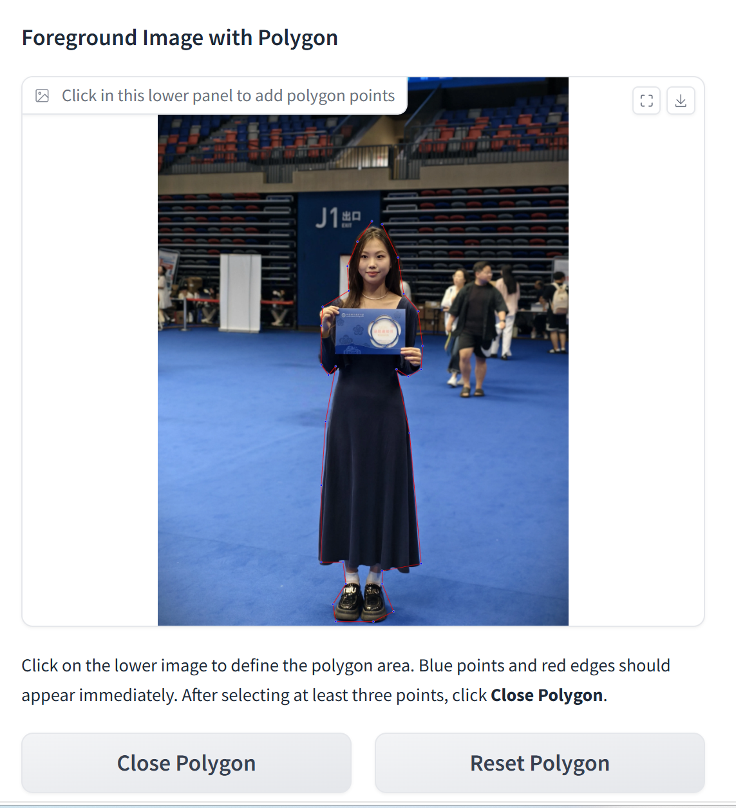
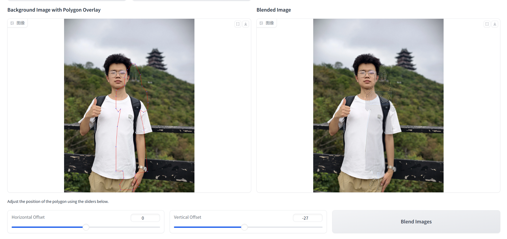
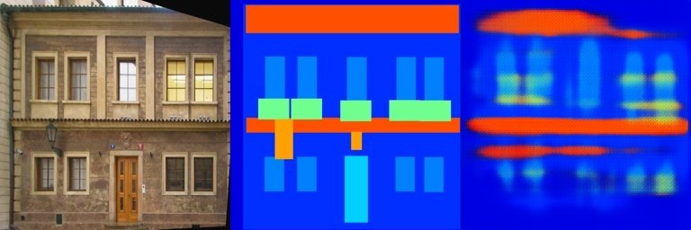
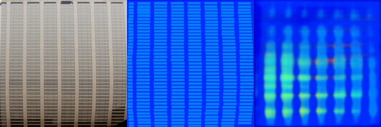

# 数字图像处理作业二

本仓库是《数字图像处理》课程第二次作业的提交内容，主要包含两部分：

1. 基于 PyTorch 的 Poisson Image Editing
2. 基于全卷积网络的 Pix2Pix 风格图像到图像转换

- 学生姓名：程开良
- 学号：SA25001013
- 课程：数字图像处理

## Requirements

本作业在如下环境中完成与测试：

```bash
conda activate myenv
```

主要依赖包括：

- `torch`
- `numpy`
- `Pillow`
- `opencv-python`
- `gradio`

如需自行安装依赖，可在激活环境后使用：

```bash
python -m pip install torch numpy pillow opencv-python gradio
```

## Training

### 任务一：Poisson Image Editing

实现文件：

- `02_DIPwithPyTorch/run_blending_gradio.py`

完成内容：

- 根据多边形顶点生成二值掩膜
- 使用 `torch.nn.functional.conv2d` 计算 Laplacian loss
- 提供前景区域选择、位置调整与融合结果展示的 Gradio 交互界面
- 对交互界面进行了可用性优化，提升点击选点的稳定性和显示效果

运行方式：

```bash
cd hw2/02_DIPwithPyTorch
python run_blending_gradio.py
```

### 任务二：Pix2Pix 风格全卷积网络

实现文件：

- `02_DIPwithPyTorch/Pix2Pix/FCN_network.py`
- `02_DIPwithPyTorch/Pix2Pix/facades_dataset.py`
- `02_DIPwithPyTorch/Pix2Pix/train.py`

完成内容：

- 构建五层卷积编码器
- 构建五层反卷积解码器
- 实现端到端前向传播
- 修复 Windows 中文路径下图像读取问题
- 增加训练参数控制与 checkpoint 续训支持

训练命令如下：

```bash
cd hw2/02_DIPwithPyTorch/Pix2Pix
python train.py --batch-size 16 --num-workers 0 --epochs 10 --sample-every 5 --checkpoint-every 10 --scheduler-step 10
python train.py --batch-size 16 --num-workers 0 --epochs 30 --start-epoch 10 --resume .\checkpoints\pix2pix_model_epoch_10.pth --sample-every 10 --checkpoint-every 10 --scheduler-step 30
```

本次训练使用：

- 数据集：Facades
- 批大小：16
- `num_workers`：0
- 优化器：Adam
- 学习率：0.001
- 损失函数：L1 Loss
- 训练设备：NVIDIA GeForce RTX 4060 Laptop GPU

## Evaluation

为便于快速验证代码正确性，仓库提供了验证脚本：

```bash
cd hw2
python verify_hw2.py
```

该脚本会检查：

- Poisson 掩膜生成
- Laplacian loss 反向传播
- FCN 输出尺寸
- Pix2Pix 数据集读取与单批次训练流程

对于任务一，还可以通过本地网页方式进行交互式验证：

```bash
cd hw2/02_DIPwithPyTorch
python run_blending_gradio.py
```

随后在浏览器中打开本地地址，上传前景图和背景图，绘制多边形区域并点击融合按钮。

## Pre-trained Models

本次作业训练得到了以下模型权重：

- `pix2pix_model_epoch_10.pth`
- `pix2pix_model_epoch_20.pth`
- `pix2pix_model_epoch_30.pth`

由于模型文件与训练中间产物较大，这些内容已在 `.gitignore` 中排除，不随仓库上传。需要时可按照上文训练命令自行复现。

## Results

### 1. Poisson Image Editing

实验示例如下：

| 前景图 | 背景图 |
| --- | --- |
|  |  |

| 选区结果 | 融合结果 |
| --- | --- |
|  |  |

结果分析：

- 已经完成从前景图中选择区域、平移到背景图并执行融合的完整流程。
- 该实现重点在于完成课程要求中的梯度约束融合流程。
- 当前示例中，由于前景和背景在姿态、尺度、光照方面差异较大，最终结果仍存在一定伪影。

### 2. Pix2Pix 风格图像翻译

验证损失变化如下：

| 阶段 | Validation Loss |
| --- | ---: |
| Epoch 10 | 0.3768 |
| 继续训练过程中的较优结果 | 约 0.3532 |
| Epoch 30 | 0.3586 |

第 20 个 epoch 的验证结果示例如下：

| 结果图 1 | 结果图 2 |
| --- | --- |
|  |  |

结果分析：

- 模型已经能够学习到一定的语义布局关系。
- 输出结果可以反映目标结构的大致位置，但边界与细节仍然较为模糊。
- 这与当前采用的基础 FCN 结构以及有限的训练轮数一致，符合课程实验的预期表现。

## Contributing

本仓库仅用于课程作业提交，不作为公共协作项目维护。

说明：

- `hw2/results/` 中保留的是用于作业报告展示的结果图。
- 数据集、checkpoint、训练中间结果目录等大文件内容已通过根目录 `.gitignore` 排除。
