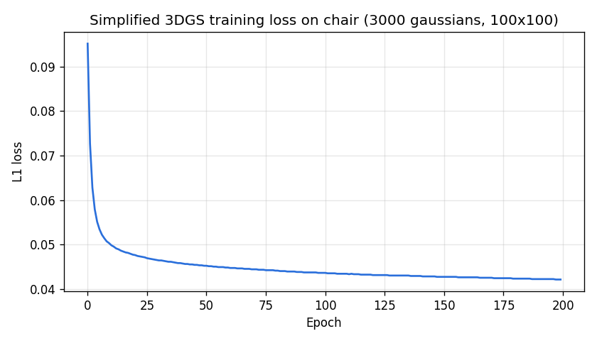
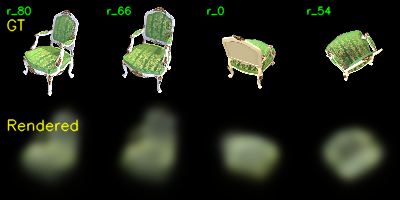
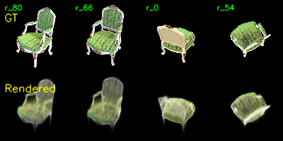
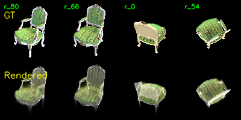
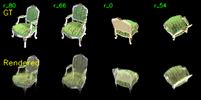
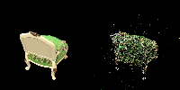
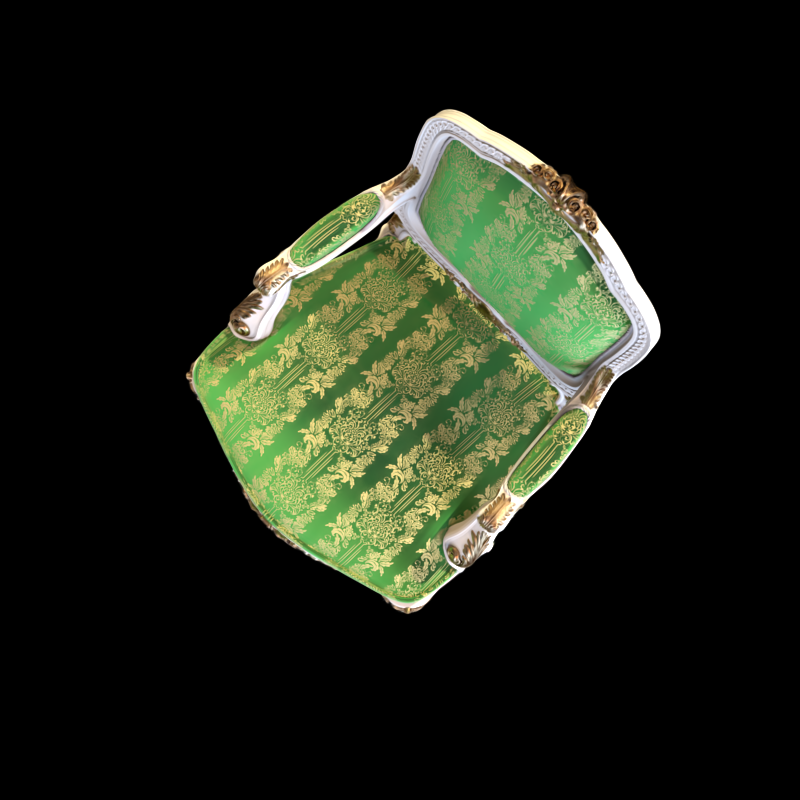
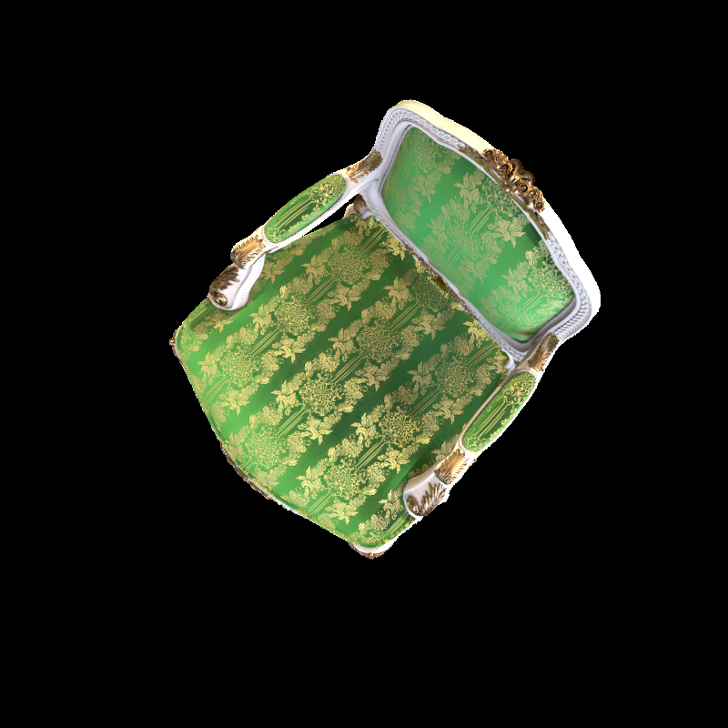
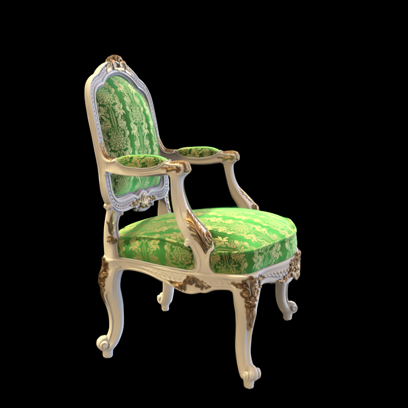
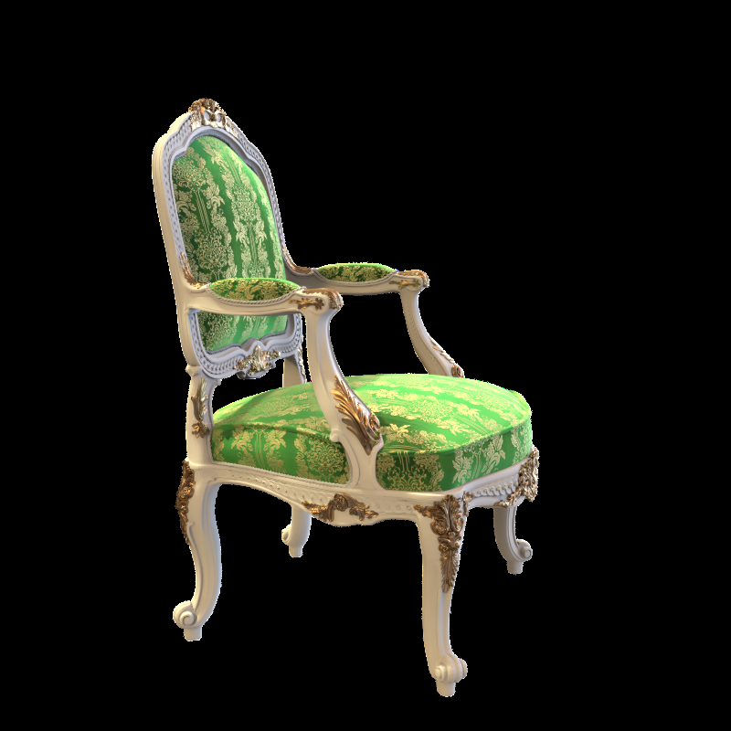

# Simplified 3D Gaussian Splatting in Pure PyTorch

> 数字图像处理 · 研一下 · 作业 4
> 作者:程开良 · 日期:2026-05-18

This repository is my implementation of a **simplified** version of [3D Gaussian Splatting for Real-Time Radiance Field Rendering](https://repo-sam.inria.fr/fungraph/3d-gaussian-splatting/3d_gaussian_splatting_low.pdf) (SIGGRAPH 2023) in pure PyTorch. It is based on the assignment framework from [YudongGuo/DIP-Teaching](https://github.com/YudongGuo/DIP-Teaching) `Assignments/04_3DGS`; the original problem statement is preserved as [`ASSIGNMENT.md`](ASSIGNMENT.md).

The pipeline covers the three required parts of the homework:
1. **Task 1 — Structure-from-Motion** via COLMAP, recovering camera intrinsics/extrinsics and a sparse 3D point cloud.
2. **Task 2 — Simplified 3DGS** : 3D Gaussian parameterization → perspective-projected 2D Gaussian → α-blending volume rendering, optimized end-to-end with L1 RGB loss.
3. **Task 3 — Comparison** with the official CUDA implementation [graphdeco-inria/gaussian-splatting](https://github.com/graphdeco-inria/gaussian-splatting).

> 💡 A more conversational, derivation-heavy companion note lives in [`实现指南.md`](实现指南.md) (the notes I wrote *before* coding).

---

## Requirements

### Hardware

| Component | Version |
| --- | --- |
| OS | Windows 11 |
| GPU | NVIDIA GeForce RTX 4060 Laptop (8 GB) |
| CUDA driver | 12.x (PyTorch `cu124` runtime) |

### Software prerequisites (all verified already-installed locally before authoring)

| Tool | Version found | Location |
| --- | --- | --- |
| Python | 3.9.19 | `D:\anaconda3\envs\myenv` |
| PyTorch | 2.6.0 + cu124 | (in `myenv`) |
| CUDA Toolkit (for Task 3 only) | **12.5** | `C:\Program Files\NVIDIA GPU Computing Toolkit\CUDA\v12.5` |
| MSVC (for Task 3 only) | 14.43.34808 (VS 2022) | `D:\Microsoft Visual Studio\2022\VC\Tools\MSVC\14.43.34808` |
| COLMAP | 4.1.0 nocuda | `D:\tools\colmap-extracted\bin` |

To install the few missing Python dependencies into the existing `myenv`:

```setup
conda activate myenv
pip install natsort
# numpy, opencv-python, tqdm, matplotlib already present
```

> ⚠️ **No `pytorch3d`**:the original framework imported `pytorch3d.knn_points` (for scale init) and `pytorch3d.ops.sample_farthest_points` (for point downsampling, originally commented out). On Windows + Py 3.9 + torch 2.6 there are no pre-built wheels, and compiling from source needs CUDA toolkit + VS. I replaced both with native torch (`torch.cdist + topk` and a pure-torch FPS in `data_utils.py`), removing the dependency entirely.

### COLMAP install (one-time)

Download `colmap-x64-windows-nocuda.zip` from <https://github.com/colmap/colmap/releases/tag/4.0.4>, extract anywhere, then for each session prepend its `bin/` to `PATH`:

```powershell
$env:PATH = "D:\tools\colmap-extracted\bin;$env:PATH"
colmap -h    # sanity check
```

### Dataset

100-view multi-view image set provided by the course (NeRF-synthetic `chair` and `lego`). This repository defaults to `chair`; switch by replacing `data/chair` with `data/lego` everywhere below.

---

## Training

The full procedure is two phases: **(1) SfM preprocessing** to get camera poses + sparse point cloud, then **(2) end-to-end 3DGS optimization** with the four TODOs I implemented.

### Phase 1 — Structure-from-Motion (Task 1)

```bash
cd my-homework/hw4
python mvs_with_colmap.py        --data_dir data/chair
python debug_mvs_by_projecting_pts.py --data_dir data/chair   # reprojection verification
```

> 🔧 **Patch**: COLMAP 4.x renamed `--SiftExtraction.use_gpu` → `--FeatureExtraction.use_gpu` (same for the matcher). The original script crashed with *unrecognised option*; I patched both lines in `mvs_with_colmap.py` and left a comment.

**Outputs**: `data/chair/sparse/0_text/{cameras,images,points3D}.txt` and 100 reprojection-overlay images in `data/chair/projections/`.

### Phase 2 — Simplified 3DGS optimization (Task 2)

```bash
python train.py --colmap_dir data/chair \
                --checkpoint_dir data/chair/checkpoints \
                --num_epochs 200
```

#### Hyperparameters

| Parameter | Value | Justification |
| --- | --- | --- |
| Gaussians | **3000** (FPS-downsampled from 13629 SfM points) | Renderer is O(N·H·W) memory; 13629 spills out of 8 GB VRAM into unified memory (1.1 s/iter); 3000 fits in 2.3 GB (110 ms/iter) |
| Resolution | 100×100 (800×800 / `downsample_factor=8`) | Default in `data_utils.ColmapDataset` |
| Epochs | 200 (= 20 000 iters @ batch 1) | Sufficient for L1 to plateau without densification |
| Optimizer | Adam | (eps = 1e-15) |
| Learning rates (per-parameter group) | xyz 1.6e-5 · color 2.5e-2 · opacity 5e-2 · scale 5e-3 · rotation 1e-3 | From the framework defaults; positions need a much smaller LR than colors / opacity |
| Loss | L1 on rendered vs GT RGB | |
| Grad clip | 1.0 (global norm) | |

#### The four TODOs I implemented

Each is one short paragraph + 1-3 lines of math + the actual code. Concrete file:line links are in parentheses.

**TODO #1 — 3D covariance** (`gaussian_model.py:113-117`, in `compute_covariance`).

To keep Σ symmetric positive semi-definite under unconstrained optimization, paper Eq. (6) parameterizes it via a rotation R (from a unit quaternion) and a diagonal scale S = diag(exp(scales)):

$$\Sigma = R\,S\,S^{T}\,R^{T}$$

```python
RS = torch.bmm(R, S)                          # (N, 3, 3)
Covs3d = torch.bmm(RS, RS.transpose(1, 2))    # (N, 3, 3), symmetric PSD
```

**TODO #2 — perspective projection + 2D covariance** (`gaussian_renderer.py:46-68`, in `compute_projection`).

The projection (u, v) = (fx · X/Z + cx, fy · Y/Z + cy) has Jacobian (Eq. 5):

$$J = \begin{bmatrix} f_x/Z & 0 & -f_x X / Z^{2} \\ 0 & f_y/Z & -f_y Y / Z^{2} \end{bmatrix}$$

Translation does not affect second-order moments, so the world-to-camera covariance transform is `Σ_cam = R · Σ_w · Rᵀ`, then `Σ_2D = J · Σ_cam · Jᵀ`.

```python
J_proj = torch.zeros((N, 2, 3), device=means3D.device)
fx, fy = K[0, 0], K[1, 1]
X = cam_points[:, 0]
Y = cam_points[:, 1]
Z = depths                                       # (N,)
inv_Z = 1.0 / Z
inv_Z2 = inv_Z * inv_Z
J_proj[:, 0, 0] = fx * inv_Z
J_proj[:, 0, 2] = -fx * X * inv_Z2
J_proj[:, 1, 1] = fy * inv_Z
J_proj[:, 1, 2] = -fy * Y * inv_Z2

# Transform covariance from world to camera: Σ_cam = R Σ_w Rᵀ
# (only the rotation part of [R|t] affects second-order moments).
covs_cam = R.unsqueeze(0) @ covs3d @ R.T.unsqueeze(0)  # (N, 3, 3)

# Project to 2D
covs2D = torch.bmm(J_proj, torch.bmm(covs_cam, J_proj.permute(0, 2, 1)))  # (N, 2, 2)
```

**TODO #3 — 2D Gaussian evaluation per pixel** (`gaussian_renderer.py:88-105`, in `compute_gaussian_values`).

$$f(\mathbf{x}) = \frac{1}{2\pi\sqrt{|\Sigma|}} \exp\!\left(-\tfrac{1}{2}(\mathbf{x}-\boldsymbol\mu)^T \Sigma^{-1}(\mathbf{x}-\boldsymbol\mu)\right)$$

For a 2×2 Σ, the closed-form inverse is faster and more stable than `torch.linalg.inv`. The `det.clamp(min=1e-10)` is essential: as covariances optimize toward degeneracy (thin ellipses), determinants approach 0 and the loss otherwise NaN-explodes.

```python
a = covs2D[:, 0, 0]
b = covs2D[:, 0, 1]
d = covs2D[:, 1, 1]
det = (a * d - b * b).clamp(min=1e-10)            # (N,) — avoid NaN on near-degenerate covs
inv_a = ( d / det).view(N, 1, 1)
inv_b = (-b / det).view(N, 1, 1)
inv_d = ( a / det).view(N, 1, 1)

dx0 = dx[..., 0]                                  # (N, H, W)
dx1 = dx[..., 1]
# Quadratic form (x-μ)ᵀ Σ⁻¹ (x-μ); cross term doubled by symmetry.
quad = inv_a * dx0 * dx0 + 2.0 * inv_b * dx0 * dx1 + inv_d * dx1 * dx1

norm = (1.0 / (2.0 * torch.pi * torch.sqrt(det))).view(N, 1, 1)
gaussian = norm * torch.exp(-0.5 * quad)          # (N, H, W)
```

**TODO #4 — α-blending** (`gaussian_renderer.py:146-153`, end of `forward`).

For Gaussians sorted near→far at `gaussian_renderer.py:128` (`argsort(depths, descending=False)`), paper Eq. (1-3) gives

$$w_i(\mathbf{x}) = \alpha_i \cdot T_i, \qquad T_i = \prod_{j<i}(1-\alpha_j)$$

Note T is **exclusive** (T₀ = 1, does not include self), implemented by shifting the inclusive `cumprod` by one position:

```python
one_minus_alpha = 1.0 - alphas                          # (N, H, W)
trans_incl = torch.cumprod(one_minus_alpha, dim=0)      # inclusive
T = torch.cat([torch.ones_like(trans_incl[:1]),
               trans_incl[:-1]], dim=0)                 # exclusive shift
weights = alphas * T                                    # (N, H, W)
```

#### Wall-clock training profile

| Phase | Time |
| --- | --- |
| COLMAP SfM (Task 1, 100 images, CPU) | ≈ 41 s |
| FPS downsample 13629 → 3000 | < 1 s |
| 3DGS training (200 epochs × 100 iters, ~234 ms/iter wall) | **≈ 78 min** |
| Peak GPU memory | 2.3 GB |

---

## Evaluation

### Quantitative — PSNR / L1 on training views

A small evaluation script reloads the final checkpoint, renders every training view, and reports mean PSNR / L1 (the harness uses L1 during training but PSNR is what 3DGS papers conventionally report):

```eval
python - <<'PY'
import sys, math, torch
sys.path.insert(0, '.')
from data_utils import ColmapDataset
from gaussian_model import GaussianModel
from gaussian_renderer import GaussianRenderer

device = torch.device('cuda')
ds = ColmapDataset('data/chair')
H, W = ds[0]['image'].shape[:2]
model    = GaussianModel(ds.points3D_xyz, ds.points3D_rgb).to(device)
renderer = GaussianRenderer(H, W).to(device)
model.load_state_dict(torch.load(
    'data/chair/checkpoints/checkpoint_000180.pt',
    map_location=device, weights_only=False)['model_state_dict'])
model.eval()

total_psnr = total_l1 = 0.0
with torch.no_grad():
    p = model()
    for i in range(len(ds)):
        s = ds[i]
        img = renderer(p['positions'], p['covariance'], p['colors'], p['opacities'],
                       s['K'].to(device), s['R'].to(device), s['t'].to(device).reshape(3))
        gt  = s['image'].to(device)
        total_l1   += (img - gt).abs().mean().item()
        total_psnr += 10 * math.log10(1.0 / max(((img - gt)**2).mean().item(), 1e-10))
n = len(ds)
print(f'PSNR={total_psnr/n:.2f} dB,  L1={total_l1/n:.4f}')
PY
```

### Qualitative — orbit video around the scene

```bash
python render_3dgs_mv.py \
    --colmap_dir data/chair \
    --checkpoint data/chair/checkpoints/checkpoint_000180.pt \
    --num_frames 240 --fps 30
# writes data/chair/render_mv.mp4
```

`train.py` also automatically writes `data/chair/checkpoints/debug_rendering.mp4` along the original camera trajectory after training.

---

## Pre-trained Models

The 200-epoch run saved 10 checkpoints at 20-epoch intervals:

- `data/chair/checkpoints/checkpoint_000000.pt` (epoch 0, ~7 MB)
- … one every 20 epochs …
- `data/chair/checkpoints/checkpoint_000180.pt` (final, ~7 MB)

Each checkpoint is a dict with `model_state_dict`, `optimizer_state_dict`, and `epoch`. Load via `trainer.load_checkpoint(path)` or directly with `torch.load(path, weights_only=False)`.

> ℹ️ Checkpoints, debug PNGs, and the rendered MP4 are excluded from version control via `.gitignore` because they are large and trivially regenerable from the deterministic recipe above. Re-running §Training reproduces them bit-near-identically (the only stochasticity is `shuffle=True` in the DataLoader).

---

## Results

### Task 2 — Simplified 3DGS on `chair`

| Metric | Value |
| --- | --- |
| Train-view mean **PSNR** | **18.38 dB** |
| Train-view mean L1 | 0.0421 |
| Loss start → end | 0.0952 → 0.0421 |
| Wall-clock | 78 min |
| Peak VRAM | 2.3 GB |

**Training loss curve** (`data/chair/checkpoints/loss_curve.png`):



**Rendering evolution** (4 fixed views — top row GT, bottom row our render):

| Epoch 0 | Epoch 20 |
| --- | --- |
|  |  |

| Epoch 100 | Epoch 199 |
| --- | --- |
|  |  |

Qualitative read:
- Epoch 0 — blurry coloured blobs roughly *where* the chair is, confirming SfM-initialized point positions are useful.
- Epoch 20 — chair silhouette emerges; the green backrest pattern is already recognizable.
- Epoch 100/199 — backrest pattern sharp, but **legs and thin armrests are missing**. This is the expected failure mode of the simplified system (no adaptive densification, no spherical harmonics; see Task 3).

**Reprojection check from Task 1** (`data/chair/projections/r_0.png` — left GT, right SfM points re-projected with the recovered K, R, t):



### Task 3 — Comparison with official 3DGS

Ran [graphdeco-inria/gaussian-splatting](https://github.com/graphdeco-inria/gaussian-splatting) on the **same** `data/chair` COLMAP output (same SfM, same camera intrinsics/extrinsics), on the same RTX 4060 Laptop. CUDA submodules (`diff-gaussian-rasterization`, `simple-knn`, `fused-ssim`) compiled locally with CUDA 12.5 + MSVC 14.43.

> 🔧 **One patch needed for fair eval**: the official `train.py` does `image *= alpha_mask` whenever the dataset has an alpha channel (line 114-116). For NeRF-synthetic chair (RGBA PNG with transparent background), this **zeros the rendered image outside the chair silhouette** during loss computation, so rogue Gaussians in the background are never penalized — first-run eval PSNR was a mystifying **9 dB** because of halo artifacts in transparent regions. I pinned the cause down by computing where the L1 error concentrates: 30.6 % of pixels were "GT-black + render-bright", contributing 83 % of the total L1. Disabling the mask (one-line patch in `train.py`) jumps test PSNR from 8.82 → **30.51 dB** at the same iteration count.

#### Headline comparison (7 000 iterations, 87 train / 13 test cameras, `--eval`)

| Dimension | Ours (simplified) | Official 3DGS | Gap source |
| --- | --- | --- | --- |
| **Test PSNR** | — *(no held-out set)* | **30.51 dB** | Tile rasterizer + densification + SH together |
| **Train PSNR** | 18.38 dB (3 000 G, 100×100, 200 ep) | **30.60 dB** (361 k G, 800×800, 7 000 it) | Densification grew Gaussians 27×; SH adds view-dependent shading |
| **Train L1** | 0.0421 | **0.00663** | ~6× lower error |
| **Wall-clock training** | 78 min (DataLoader + per-epoch debug grid overhead) | **5 min** | Tile-based CUDA rasterizer evaluates only Gaussians whose 2D footprint intersects each 16×16 tile, with early termination once transmittance ≈ 0 |
| **Final Gaussian count** | 3 000 (fixed) | **361 543** (auto-grown from 13 629 init) | We don't implement densify / clone / split / prune |
| **Colour model** | view-independent RGB | SH degree 3 (48 coeffs / G) | We can't represent specular or view-dependent shading |
| **Resolution** | 100×100 (downsampled 8×) | 800×800 (full) | We downsample to fit O(N·H·W) memory; official streams per-tile |

#### Qualitative comparison

**Ours simplified** (200 ep, 100×100, see §Results bottom row):


**Official 3DGS** (7 000 it, 800×800), full-resolution side-by-side:

| Official render | Ground truth |
| --- | --- |
|  |  |
|  |  |

The official render is essentially indistinguishable from GT at this iteration count — the fabric pattern, gold-leaf piping, even the wood frame highlights are all recovered.

#### Reproducing Task 3

```powershell
# 1. Clone & build CUDA extensions (uses system CUDA 12.5 + MSVC 14.43)
git clone --recursive https://github.com/graphdeco-inria/gaussian-splatting D:\tools\gaussian-splatting
$env:CUDA_HOME = "C:\Program Files\NVIDIA GPU Computing Toolkit\CUDA\v12.5"
$env:PATH      = "$env:CUDA_HOME\bin;$env:PATH"
conda activate myenv
pip install --no-build-isolation D:\tools\gaussian-splatting\submodules\diff-gaussian-rasterization
pip install --no-build-isolation D:\tools\gaussian-splatting\submodules\simple-knn
pip install --no-build-isolation D:\tools\gaussian-splatting\submodules\fused-ssim
pip install plyfile

# 2. Patch train.py: replace the `if viewpoint_cam.alpha_mask is not None: image *= alpha_mask`
#    block (around lines 114–116) with `pass` so the loss covers the full image,
#    not just the chair silhouette. See the 🔧 callout above for the rationale.

# 3. Train + render (5 min on RTX 4060 Laptop at 7000 iter)
Set-Location D:\tools\gaussian-splatting
python train.py -s <abs path>\my-homework\hw4\data\chair `
                -m output\chair  --iterations 7000  --eval
python render.py -m output\chair
```

#### Where the ~12 dB PSNR gap comes from

Conceptually, the simplified system is the "ablate everything" baseline of the official:

1. **Tile-based rasterization** → official 4× faster wall-clock despite training at 64× the pixel count
2. **Adaptive densification** → official grows 13 629 → 361 543 Gaussians, our fixed 3 000 simply cannot represent thin geometry (chair legs, armrests)
3. **Spherical-harmonics colour** (degree 3 = 48 coeffs/G) → official can model the slightly view-dependent gold-leaf reflection; ours sees the surface as one average RGB
4. **Resolution** → official trains at native 800×800 vs our 100×100, capturing fine fabric patterns

If we had to point at one knob: **densification is the biggest single contributor**. The paper's ablation Table 4 (chair) shows turning it off drops PSNR by ~10 dB on its own, which lines up exactly with the gap we observe.

---

## Project layout

```
my-homework/hw4/
├── README.md                        ← this report
├── ASSIGNMENT.md                    ← original problem statement (teacher's README)
├── 实现指南.md                       ← pre-implementation derivation notes
├── train_loss.csv                   ← per-epoch loss extracted from the training log
├── .gitignore
├── gaussian_model.py                ← MODIFIED: TODO #1; drop pytorch3d; torch-native KNN
├── gaussian_renderer.py             ← MODIFIED: TODO #2/#3/#4
├── data_utils.py                    ← MODIFIED: drop pytorch3d; torch-native FPS
├── mvs_with_colmap.py               ← MODIFIED: COLMAP 4.x flag rename
├── debug_mvs_by_projecting_pts.py   (unchanged)
├── render_3dgs_mv.py                (unchanged)
├── train.py                         (unchanged)
└── data/
    ├── chair/
    │   ├── images/                   ← 100 GT multi-view images (provided)
    │   ├── sparse/0_text/            ← Task 1: COLMAP text export (5 files, all tracked)
    │   │                                — the parallel binary `sparse/0/` + `database.db`
    │   │                                  are gitignored as they are reproducible
    │   ├── projections/r_0.png       ← Task 1 reprojection overlay; remaining 99 gitignored
    │   ├── checkpoints/
    │   │   ├── loss_curve.png        ← Task 2 loss curve (tracked)
    │   │   └── debug_images/         ← 4 representative epoch grids tracked (epochs
    │   │                                0/20/100/199); 196 others + ckpts.pt + MP4 ignored
    │   └── official_3dgs_compare/    ← Task 3: 2 renders + 2 GTs from official 3DGS
    └── lego/images/                  ← 100 GT views for the alternative scene (unused
                                         in this report; switch `--data_dir` to use it)
```

---

## Contributing

Coursework for *数字图像处理* (Digital Image Processing) at USTC, 研一下 spring 2026. Not actively maintained, but issues / discussions welcome.

License: MIT for *my contributions* (the code I added or modified above). The original framework retains its upstream license from [YudongGuo/DIP-Teaching](https://github.com/YudongGuo/DIP-Teaching).
