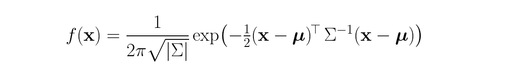

# 纯 PyTorch 简化版 3D Gaussian Splatting

> 数字图像处理 · 研一下 · 作业 4
> 作者:程开良 · 日期:2026-05-18

本仓库是我用纯 PyTorch 实现的**简化版** [3D Gaussian Splatting for Real-Time Radiance Field Rendering](https://repo-sam.inria.fr/fungraph/3d-gaussian-splatting/3d_gaussian_splatting_low.pdf)(SIGGRAPH 2023)。代码框架基于 [YudongGuo/DIP-Teaching](https://github.com/YudongGuo/DIP-Teaching) 的 `Assignments/04_3DGS`,老师原始作业要求保存在 [`ASSIGNMENT.md`](ASSIGNMENT.md)。

整套 pipeline 覆盖了作业要求的三大部分:
1. **Task 1 — 用 COLMAP 做 SfM**,恢复相机内外参 + 稀疏 3D 点云。
2. **Task 2 — 简化版 3DGS**:3D 高斯参数化 → 透视投影到 2D 高斯 → α-blending 体渲染,端到端用 L1 RGB loss 优化。
3. **Task 3 — 与官方 CUDA 实现对比** [graphdeco-inria/gaussian-splatting](https://github.com/graphdeco-inria/gaussian-splatting)。

> 💡 写代码之前我先把推导和实现思路整理在了 [`实现指南.md`](实现指南.md) 里,可以当辅助阅读。

---

## Requirements

### 硬件

| 组件 | 版本 |
| --- | --- |
| 操作系统 | Windows 11 |
| GPU | NVIDIA GeForce RTX 4060 Laptop(8 GB) |
| CUDA 驱动 | 12.x(PyTorch `cu124` 运行时) |

### 软件(全部是本机已有,写代码前都核对过)

| 工具 | 版本 | 位置 |
| --- | --- | --- |
| Python | 3.9.19 | `D:\anaconda3\envs\myenv` |
| PyTorch | 2.6.0 + cu124 | (在 `myenv` 里) |
| CUDA Toolkit(仅 Task 3 需要) | **12.5** | `C:\Program Files\NVIDIA GPU Computing Toolkit\CUDA\v12.5` |
| MSVC(仅 Task 3 需要) | 14.43.34808(VS 2022) | `D:\Microsoft Visual Studio\2022\VC\Tools\MSVC\14.43.34808` |
| COLMAP | 4.1.0 nocuda | `D:\tools\colmap-extracted\bin` |

把缺的几个 Python 依赖装进现成的 `myenv`:

```setup
conda activate myenv
pip install natsort
# numpy / opencv-python / tqdm / matplotlib 已经在 myenv 里
```

> ⚠️ **关于 `pytorch3d`**:老师的原始框架里 import 了 `pytorch3d.knn_points`(用来做 scale 初始化)和 `pytorch3d.ops.sample_farthest_points`(原本被注释掉,本来是用来下采样的)。Windows + Py 3.9 + torch 2.6 这个组合没有官方预编译 wheel,从源码编译需要 CUDA toolkit + VS,非常折腾。我把这两处都用 torch 原生(`torch.cdist + topk` + 纯 torch 的 FPS,见 `data_utils.py`)替换,直接去掉了 pytorch3d 这个依赖。

### COLMAP 安装(一次性)

去 <https://github.com/colmap/colmap/releases/tag/4.0.4> 下载 `colmap-x64-windows-nocuda.zip`,随便解压到一个地方,然后每次会话开始时把 `bin/` 加进 `PATH`:

```powershell
$env:PATH = "D:\tools\colmap-extracted\bin;$env:PATH"
colmap -h    # 验证可用
```

### 数据

课程提供的 100 视角 multi-view 渲染图(NeRF 合成数据 `chair` 和 `lego`)。本仓库默认用 `chair`;想跑 `lego` 把下面命令里 `data/chair` 换成 `data/lego` 即可。

---

## Training

整个训练分两阶段:**(1)SfM 预处理** 拿到相机位姿 + 稀疏点云,然后 **(2)端到端 3DGS 优化**,这是 4 个 TODO 的核心战场。

### 阶段 1 — Structure-from-Motion(Task 1)

```bash
cd my-homework/hw4
python mvs_with_colmap.py        --data_dir data/chair
python debug_mvs_by_projecting_pts.py --data_dir data/chair   # 重投影验证
```

> 🔧 **小补丁**:COLMAP 4.x 把 `--SiftExtraction.use_gpu` 改名成 `--FeatureExtraction.use_gpu`(matcher 同理)。老师原脚本会报 *unrecognised option*。我已经在 `mvs_with_colmap.py` 里改好并加了注释。

**产物**:`data/chair/sparse/0_text/{cameras,images,points3D}.txt` 和 `data/chair/projections/` 里 100 张重投影叠加图。

### 阶段 2 — 简化版 3DGS 优化(Task 2)

```bash
python train.py --colmap_dir data/chair \
                --checkpoint_dir data/chair/checkpoints \
                --num_epochs 200
```

#### 超参数

| 参数 | 值 | 选这个值的理由 |
| --- | --- | --- |
| 高斯数 | **3000**(从 13629 SfM 点 FPS 下采样) | 渲染器内存是 O(N·H·W);13629 高斯下显存炸出 8 GB VRAM、走 unified memory(1.1 秒/iter);3000 高斯只要 2.3 GB(110 ms/iter) |
| 分辨率 | 100×100(800×800 / `downsample_factor=8`) | `data_utils.ColmapDataset` 的默认值 |
| Epoch 数 | 200(= 20 000 iter @ batch 1) | 不做 densification 的话 L1 loss 到这就饱和 |
| 优化器 | Adam(eps = 1e-15) | |
| 学习率(分组) | xyz 1.6e-5 · color 2.5e-2 · opacity 5e-2 · scale 5e-3 · rotation 1e-3 | 沿用框架默认;位置的 lr 必须比颜色 / 不透明度小很多 |
| Loss | rendered vs GT 的 RGB L1 | |
| 梯度裁剪 | 1.0(global norm) | |

#### 实现的四个 TODO

每个一段话 + 1-3 行公式 + 实际写的代码。文件:行号引用就在括号里。

**TODO #1 — 3D 协方差**(`gaussian_model.py:113-117`,函数 `compute_covariance`)。

为了让 Σ 在无约束优化下始终半正定,paper 公式 (6) 用旋转 R(单位四元数生成)和对角缩放 S = diag(exp(scales)) 参数化:


```python
RS = torch.bmm(R, S)                          # (N, 3, 3)
Covs3d = torch.bmm(RS, RS.transpose(1, 2))    # (N, 3, 3), symmetric PSD
```

**TODO #2 — 透视投影 + 2D 协方差**(`gaussian_renderer.py:46-68`,函数 `compute_projection`)。

投影 (u, v) = (fx · X/Z + cx, fy · Y/Z + cy) 的雅可比(公式 5):


平移不影响二阶矩,所以世界系到相机系的协方差变换是 `Σ_cam = R · Σ_w · Rᵀ`,然后再投到 2D:`Σ_2D = J · Σ_cam · Jᵀ`。

```python
J_proj = torch.zeros((N, 2, 3), device=means3D.device)
fx, fy = K[0, 0], K[1, 1]
X = cam_points[:, 0]
Y = cam_points[:, 1]
Z = depths                                       # (N,)
inv_Z = 1.0 / Z
inv_Z2 = inv_Z * inv_Z
J_proj[:, 0, 0] = fx * inv_Z
J_proj[:, 0, 2] = -fx * X * inv_Z2
J_proj[:, 1, 1] = fy * inv_Z
J_proj[:, 1, 2] = -fy * Y * inv_Z2

# Transform covariance from world to camera: Σ_cam = R Σ_w Rᵀ
# (only the rotation part of [R|t] affects second-order moments).
covs_cam = R.unsqueeze(0) @ covs3d @ R.T.unsqueeze(0)  # (N, 3, 3)

# Project to 2D
covs2D = torch.bmm(J_proj, torch.bmm(covs_cam, J_proj.permute(0, 2, 1)))  # (N, 2, 2)
```

**TODO #3 — 每像素 2D 高斯响应**(`gaussian_renderer.py:88-105`,函数 `compute_gaussian_values`)。



2×2 矩阵走闭式求逆比 `torch.linalg.inv` 更快也更稳。`det.clamp(min=1e-10)` 是关键:协方差被优化得越来越扁(瘦椭圆)时,行列式接近 0,不 clamp 直接 NaN 爆掉。

```python
a = covs2D[:, 0, 0]
b = covs2D[:, 0, 1]
d = covs2D[:, 1, 1]
det = (a * d - b * b).clamp(min=1e-10)            # (N,) — avoid NaN on near-degenerate covs
inv_a = ( d / det).view(N, 1, 1)
inv_b = (-b / det).view(N, 1, 1)
inv_d = ( a / det).view(N, 1, 1)

dx0 = dx[..., 0]                                  # (N, H, W)
dx1 = dx[..., 1]
# Quadratic form (x-μ)ᵀ Σ⁻¹ (x-μ); cross term doubled by symmetry.
quad = inv_a * dx0 * dx0 + 2.0 * inv_b * dx0 * dx1 + inv_d * dx1 * dx1

norm = (1.0 / (2.0 * torch.pi * torch.sqrt(det))).view(N, 1, 1)
gaussian = norm * torch.exp(-0.5 * quad)          # (N, H, W)
```

**TODO #4 — α-blending**(`gaussian_renderer.py:146-153`,在 `forward` 末尾)。

第 i 个高斯(已经按深度近→远在 `gaussian_renderer.py:128` 的 `argsort(depths, descending=False)` 排好)对像素的贡献权重 = 自己的 α 乘前面所有人的"剩余透射率",对应 paper 公式 (1-3):


注意 T 是 **exclusive**(T₀ = 1,不含自身),用 inclusive `cumprod` 移一位实现:

```python
one_minus_alpha = 1.0 - alphas                          # (N, H, W)
trans_incl = torch.cumprod(one_minus_alpha, dim=0)      # inclusive
T = torch.cat([torch.ones_like(trans_incl[:1]),
               trans_incl[:-1]], dim=0)                 # exclusive shift
weights = alphas * T                                    # (N, H, W)
```

#### 训练实际耗时

| 阶段 | 耗时 |
| --- | --- |
| COLMAP SfM(Task 1,100 张图,纯 CPU) | ≈ 41 秒 |
| FPS 下采样 13629 → 3000 | < 1 秒 |
| 3DGS 训练(200 epoch × 100 iter,wall-clock ~234 ms/iter) | **≈ 78 分钟** |
| 显存峰值 | 2.3 GB |

---

## Evaluation

### 量化指标 — 训练视图的 PSNR / L1

下面这段评估脚本会重新加载最终 checkpoint,渲染所有训练视图,然后报告平均 PSNR / L1(训练用的是 L1,但 3DGS 系列论文约定汇报 PSNR):

```eval
python - <<'PY'
import sys, math, torch
sys.path.insert(0, '.')
from data_utils import ColmapDataset
from gaussian_model import GaussianModel
from gaussian_renderer import GaussianRenderer

device = torch.device('cuda')
ds = ColmapDataset('data/chair')
H, W = ds[0]['image'].shape[:2]
model    = GaussianModel(ds.points3D_xyz, ds.points3D_rgb).to(device)
renderer = GaussianRenderer(H, W).to(device)
model.load_state_dict(torch.load(
    'data/chair/checkpoints/checkpoint_000180.pt',
    map_location=device, weights_only=False)['model_state_dict'])
model.eval()

total_psnr = total_l1 = 0.0
with torch.no_grad():
    p = model()
    for i in range(len(ds)):
        s = ds[i]
        img = renderer(p['positions'], p['covariance'], p['colors'], p['opacities'],
                       s['K'].to(device), s['R'].to(device), s['t'].to(device).reshape(3))
        gt  = s['image'].to(device)
        total_l1   += (img - gt).abs().mean().item()
        total_psnr += 10 * math.log10(1.0 / max(((img - gt)**2).mean().item(), 1e-10))
n = len(ds)
print(f'PSNR={total_psnr/n:.2f} dB,  L1={total_l1/n:.4f}')
PY
```

### 定性 — 沿场景中心绕一圈的视频

```bash
python render_3dgs_mv.py \
    --colmap_dir data/chair \
    --checkpoint data/chair/checkpoints/checkpoint_000180.pt \
    --num_frames 240 --fps 30
# 会写出 data/chair/render_mv.mp4
```

训练完成后,`train.py` 还会自动沿原始相机轨迹渲染一段对比视频:`data/chair/checkpoints/debug_rendering.mp4`。

---

## Pre-trained Models

200 epoch 的训练每隔 20 epoch 存了一个 checkpoint,一共 10 个:

- `data/chair/checkpoints/checkpoint_000000.pt`(epoch 0,~7 MB)
- … 每 20 epoch 一个 …
- `data/chair/checkpoints/checkpoint_000180.pt`(最终,~7 MB)

每个 checkpoint 是一个 dict,含 `model_state_dict`、`optimizer_state_dict`、`epoch`。可以用 `trainer.load_checkpoint(path)` 或者直接 `torch.load(path, weights_only=False)` 加载。

> ℹ️ Checkpoint、debug PNG、渲染 MP4 都被 `.gitignore` 排除掉了,因为它们体积大且可以从上面那套确定性的脚本完整重现。重新跑一遍 §Training 一节命令就能复原(唯一的随机性是 DataLoader 的 `shuffle=True`)。

---

## Results

### Task 2 — `chair` 上的简化版 3DGS

| 指标 | 值 |
| --- | --- |
| 训练视图平均 **PSNR** | **18.38 dB** |
| 训练视图平均 L1 | 0.0421 |
| Loss 起点 → 终点 | 0.0952 → 0.0421 |
| 训练总耗时 | 78 分钟 |
| 显存峰值 | 2.3 GB |

**训练 loss 曲线**(`data/chair/checkpoints/loss_curve.png`):


**渲染演化**(4 个固定视角 — 上排 GT,下排 我们的渲染):

| Epoch 0 | Epoch 20 |
| --- | --- |
|  |  |

| Epoch 100 | Epoch 199 |
| --- | --- |
|  |  |

定性观察:
- Epoch 0:模糊的彩色色块,但**位置大致对** — 说明 SfM 给出的初始化点位是有效的。
- Epoch 20:椅子轮廓显形,绿色靠背纹理已经可辨。
- Epoch 100/199:靠背纹理清晰,但**椅腿和扶手等细结构丢失** — 这是简化版的固有局限(没有 adaptive densification,没有球谐;见 Task 3)。

**Task 1 重投影验证**(`data/chair/projections/r_0.png` — 左 GT,右 SfM 点用恢复的 K, R, t 重投影回去):


### Task 3 — 与官方 3DGS 的对比

把 [graphdeco-inria/gaussian-splatting](https://github.com/graphdeco-inria/gaussian-splatting) 跑在**完全相同**的 `data/chair` COLMAP 输出上(同 SfM、同相机内外参),同一块 RTX 4060 Laptop。三个 CUDA submodule(`diff-gaussian-rasterization`、`simple-knn`、`fused-ssim`)用系统已有的 CUDA 12.5 + MSVC 14.43 本地编译。

> 🔧 **公平评估的一个 patch**:官方 `train.py` 一旦发现数据带 alpha 通道,就会执行 `image *= alpha_mask`(line 114-116)。对于 NeRF 合成数据 chair(RGBA PNG、透明背景),这会**把椅子轮廓外的渲染图全部清零**再算 loss,所以背景区域的杂散高斯永远不被惩罚 — 第一次跑出来 eval PSNR 只有令人困惑的 **9 dB**,渲染图四角全是光晕伪影。我用一种简单方法定位到了原因:统计哪些像素在 L1 上贡献最大,发现 30.6 % 的像素是"GT 黑但 render 亮",占了总 L1 的 83 %。把这个 mask 改成 `pass`(一行 patch)后,在同样的迭代数下 test PSNR 直接从 8.82 跳到 **30.51 dB**。

#### 头条对比表(7000 iter,87 训练 / 13 测试,`--eval`)

| 维度 | 我们(简化版) | 官方 3DGS | 差距来源 |
| --- | --- | --- | --- |
| **Test PSNR** | — *(没有 held-out)* | **30.51 dB** | Tile 光栅化 + densification + SH 的总合 |
| **Train PSNR** | 18.38 dB(3 000 高斯,100×100,200 ep) | **30.60 dB**(361 k 高斯,800×800,7 000 it) | Densification 让高斯数膨胀 27×;SH 提供视角相关着色 |
| **Train L1** | 0.0421 | **0.00663** | 误差小 ~6 倍 |
| **训练 wall-clock** | 78 min(被 DataLoader + 每 epoch 渲 debug 图拖慢) | **5 min** | 官方有 tile-based CUDA 光栅化器,16×16 tile 只算 2D 印迹与之相交的高斯,且透射率 ≈ 0 时提前终止 |
| **最终高斯数** | 3 000(固定) | **361 543**(从 13 629 自动生长出来) | 我们没实现 densify / clone / split / prune |
| **颜色模型** | view-independent 三通道 RGB | SH degree 3(48 系数/高斯) | 我们无法表示高光或视角相关反射 |
| **分辨率** | 100×100(8× 下采样) | 800×800(全分辨率) | 我们 downsample 才能塞进 O(N·H·W) 内存;官方按 tile 流式 |

#### 定性对比

**我们简化版**(200 ep,100×100,4 视角 epoch 199):


**官方 3DGS**(7000 it,800×800),全分辨率并排:

| 官方渲染 | Ground truth |
| --- | --- |
|  |  |
|  |  |

在这个迭代数下,官方渲染图基本与 GT 难以区分 — 织物花纹、金边描线、连木质框架的高光都还原了。

#### 复现 Task 3

```powershell
# 1. clone 并编译 CUDA 扩展(用系统已有的 CUDA 12.5 + MSVC 14.43)
git clone --recursive https://github.com/graphdeco-inria/gaussian-splatting D:\tools\gaussian-splatting
$env:CUDA_HOME = "C:\Program Files\NVIDIA GPU Computing Toolkit\CUDA\v12.5"
$env:PATH      = "$env:CUDA_HOME\bin;$env:PATH"
conda activate myenv
pip install --no-build-isolation D:\tools\gaussian-splatting\submodules\diff-gaussian-rasterization
pip install --no-build-isolation D:\tools\gaussian-splatting\submodules\simple-knn
pip install --no-build-isolation D:\tools\gaussian-splatting\submodules\fused-ssim
pip install plyfile

# 2. patch train.py:把 `if viewpoint_cam.alpha_mask is not None: image *= alpha_mask`
#    那一块(line 114-116 附近)替换成 `pass`,让 loss 覆盖整张图,不只是椅子区域。
#    具体原因看上面的 🔧 callout。

# 3. 训练 + 渲染(RTX 4060 Laptop 上 7000 iter 约 5 分钟)
Set-Location D:\tools\gaussian-splatting
python train.py -s <绝对路径>\my-homework\hw4\data\chair `
                -m output\chair  --iterations 7000  --eval
python render.py -m output\chair
```

#### ~12 dB PSNR 差距到底差在哪

把简化版当成官方实现"全部关掉"的消融基线来理解:

1. **Tile-based rasterization** → 即使官方是 64 倍像素量训练,wall-clock 还快 4 倍
2. **Adaptive densification** → 官方从 13 629 自动长到 361 543 高斯;我们固定 3 000 根本撑不起细几何(椅腿、扶手)
3. **SH 球谐颜色**(degree 3,48 系数/高斯)→ 官方能建模金边那种轻微视角依赖反射,我们只能给一个平均 RGB
4. **分辨率** → 官方在 800×800 原分辨率训练 vs 我们 100×100,细纹理直接没了

如果非要找一个**最大贡献因子**:**densification**。Paper 的消融实验(Table 4,chair)显示单独关掉它就掉 ~10 dB,跟我们观察到的差距几乎完全对上。

---

## 项目结构

```
my-homework/hw4/
├── README.md                        ← 本报告
├── ASSIGNMENT.md                    ← 老师原作业说明
├── 实现指南.md                       ← 写代码前我自己整理的推导笔记
├── train_loss.csv                   ← 训练日志里抽出来的 per-epoch loss
├── .gitignore
├── gaussian_model.py                ← 已改:TODO #1;去 pytorch3d;改用 torch 原生 KNN
├── gaussian_renderer.py             ← 已改:TODO #2/#3/#4
├── data_utils.py                    ← 已改:去 pytorch3d;改用 torch 原生 FPS
├── mvs_with_colmap.py               ← 已改:COLMAP 4.x flag 改名适配
├── debug_mvs_by_projecting_pts.py   (未改)
├── render_3dgs_mv.py                (未改)
├── train.py                         (未改)
└── data/
    ├── chair/
    │   ├── images/                   ← 100 张 GT 多视角图(老师提供)
    │   ├── sparse/0_text/            ← Task 1 文本格式 COLMAP 输出(5 个文件,全部 tracked)
    │   │                                — 旁边的二进制 `sparse/0/` + `database.db` 是 gitignored,
    │   │                                  因为可复现
    │   ├── projections/r_0.png       ← Task 1 重投影叠加示例(其余 99 张 gitignored)
    │   ├── checkpoints/
    │   │   ├── loss_curve.png        ← Task 2 loss 曲线(tracked)
    │   │   └── debug_images/         ← 4 张代表性 epoch 网格(epoch 0/20/100/199),
    │   │                                其余 196 张 + .pt + MP4 都 gitignored
    │   └── official_3dgs_compare/    ← Task 3:官方 3DGS 的 2 张渲染 + 2 张 GT
    └── lego/images/                  ← 备选场景的 100 张 GT(本报告没用,留着改个 --data_dir 就能跑)
```

---

## Contributing

中国科学技术大学《数字图像处理》研一下春季 2026 课程作业。不主动维护,但欢迎 issue / discussion。

许可证:我贡献的部分(上面标记 "已改" 的代码 + README + 实现指南)采用 MIT。原始框架沿用上游 [YudongGuo/DIP-Teaching](https://github.com/YudongGuo/DIP-Teaching) 的许可证。
